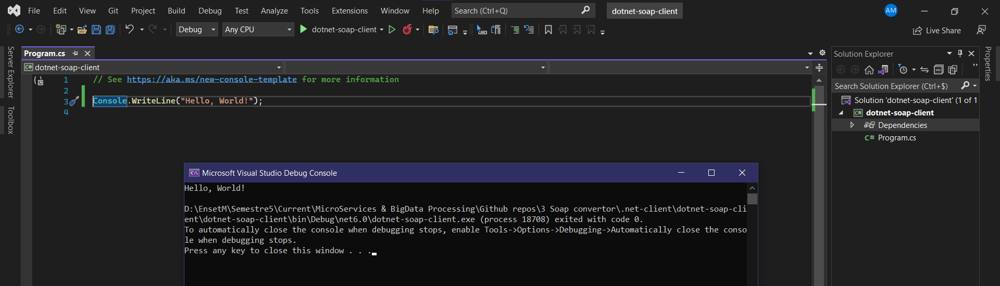
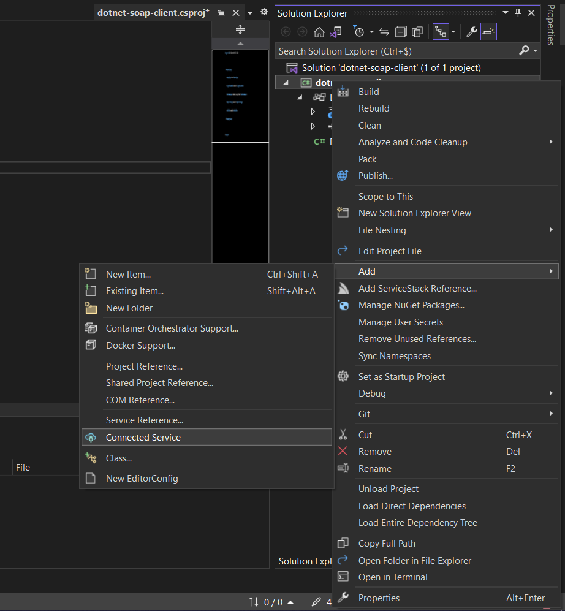
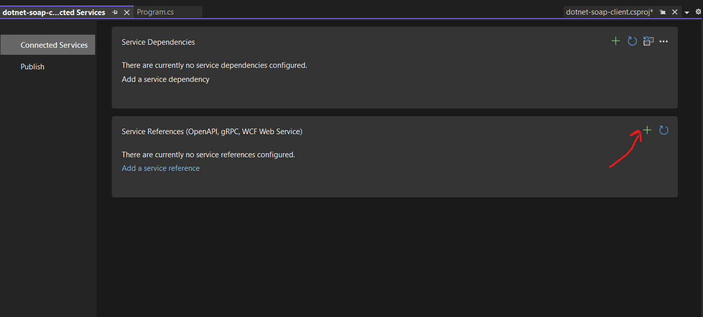
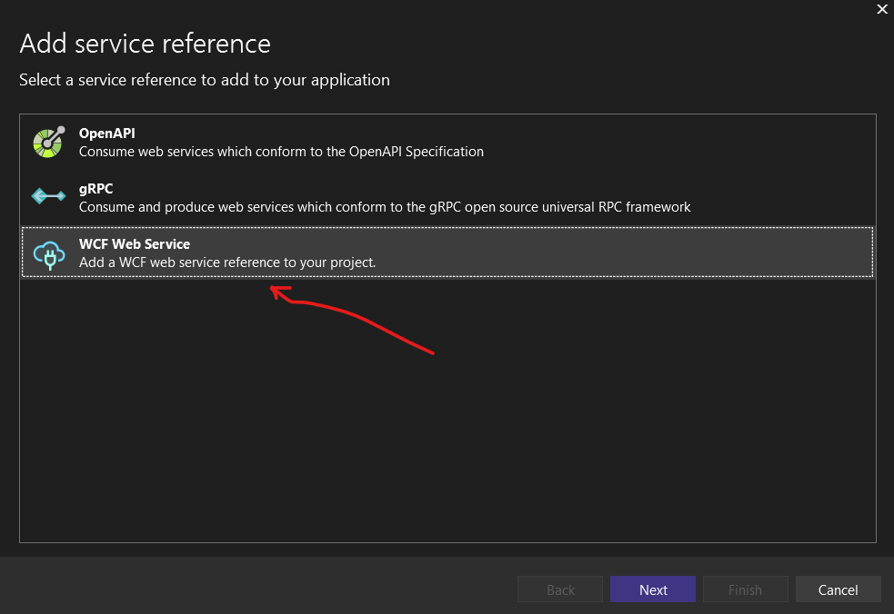
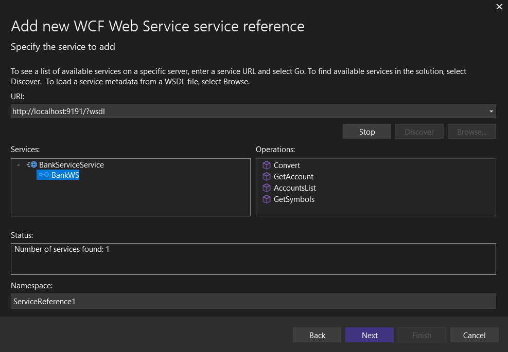
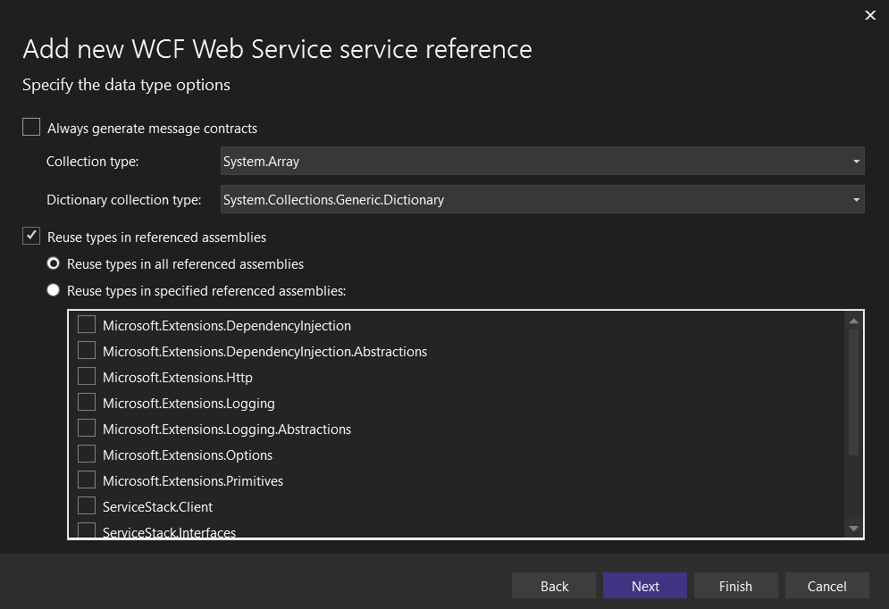
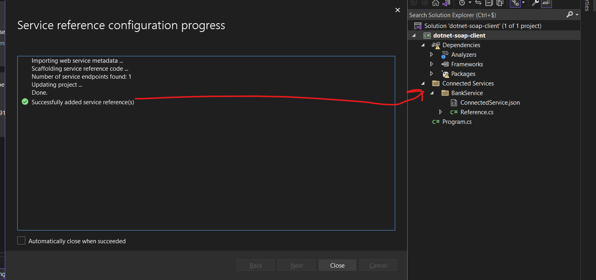
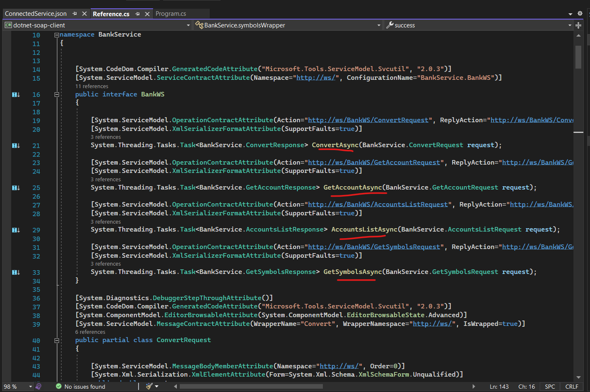
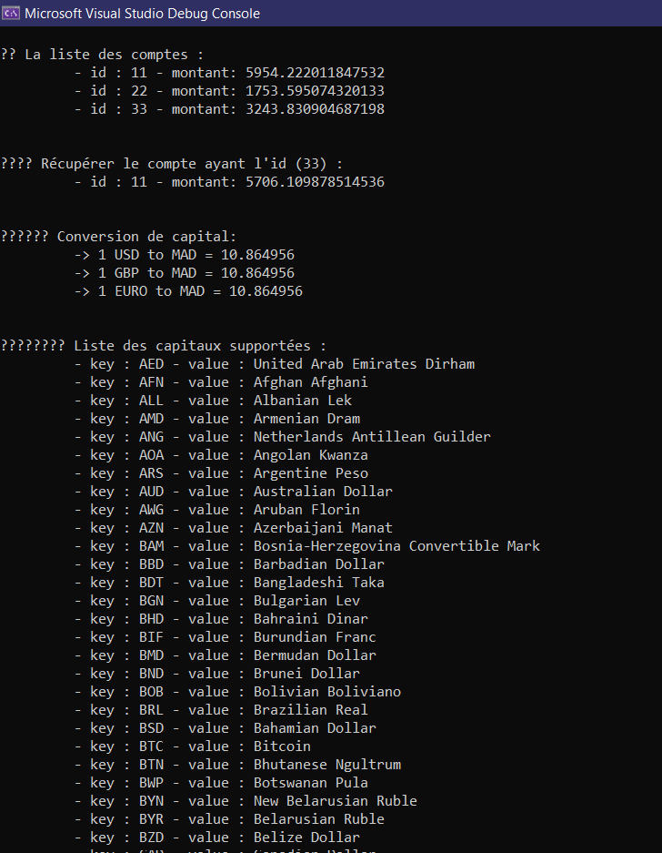

## Créer le client .Net qui va consommer les méthodes de [soap-ws](../soap-ws)


### Configuration utilisé : 

```
	- projet dotnet (Créé à partir de visualStudio )
	- dotnet 6
```


<br>

### Structure de projet :

* initialisé le projet avec Visual Studio: 

<p align="center">

</p>

<br>


### Générer du code et classes nécessaires pour intéragir avec le serveur JaxWS : 

* L'éditeur Visual studio comporte un moyen pour faire rapidement cette tâche ; voir l'article suivant https://medium.com/compendium/integrating-with-soap-web-services-in-net-core-adebfad173fb

<p align="center">













</p>


* la classe (Client) comportant les méthodes pour communiquer avec le serveur Soap est bien générée : 

<p align="center">

</p>


<br>


### Le programme client : 

* ensuite j'ai écrit un script/programme qui va utiliser le client SOAP pour communiquer avec le serveur : 

[👉 Program.cs](./dotnet-soap-client/dotnet-soap-client/Program.cs)

```
using BankService;

BankWSClient bankWSClient = new BankWSClient();

AccountsListResponse accountsListResponse = await bankWSClient.AccountsListAsync();
Console.WriteLine("\n👾 La liste des comptes : ");
account[] list = accountsListResponse.@return;
foreach( account acc in list)
{
  Console.WriteLine("\t - id : " + acc.id + " - montant: " + acc.balance);
}


Console.WriteLine("\n\n👾👾 Récupérer le compte ayant l'id (33) : ");
GetAccountResponse getAccountResponse = await bankWSClient.GetAccountAsync(33);
account account = getAccountResponse.@return;
Console.WriteLine("\t - id : " + account.id + " - montant: " + account.balance);


ConvertResponse usd_to_mad = await bankWSClient.ConvertAsync(1, "USD", "MAD");
ConvertResponse euro_to_mad = await bankWSClient.ConvertAsync(1, "EURO", "MAD");
ConvertResponse gbp_to_mad = await bankWSClient.ConvertAsync(1, "GBP", "MAD");


Console.WriteLine("\n\n👾👾👾 Conversion de capital: ");
Console.WriteLine("\t -> 1 USD to MAD = " + usd_to_mad.@return.ToString() );
Console.WriteLine("\t -> 1 GBP to MAD = " + usd_to_mad.@return.ToString() );
Console.WriteLine("\t -> 1 EURO to MAD = " + usd_to_mad.@return.ToString() );


Console.WriteLine("\n\n👾👾👾👾 Liste des capitaux supportées : ");
GetSymbolsResponse symbolsResponse = await bankWSClient.GetSymbolsAsync();
symbolsWrapper symbolsWrapper = symbolsResponse.@return;
symbolsWrapperEntry[] entries = symbolsWrapper.symbols;
foreach( symbolsWrapperEntry entry in entries){
  Console.WriteLine("\t - key : " + entry.key + " - value : " + entry.value); 
}

....

```

<br>

* une partie de l'output : 


<p align="center">

</p>

> end.<