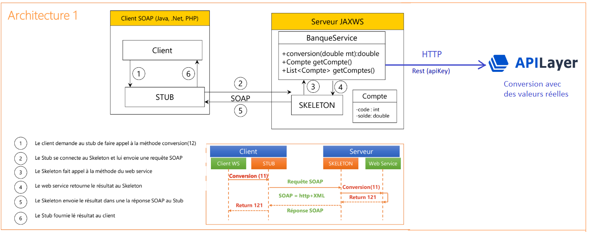
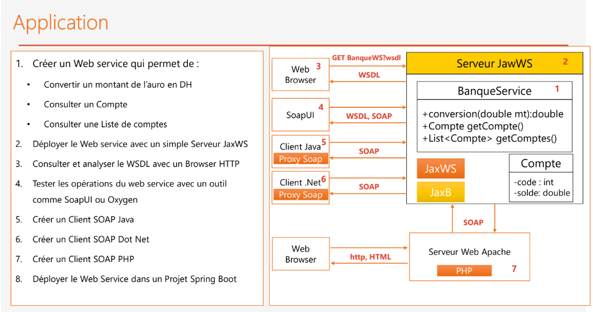

# Communiquer les microservices avec SOAP

## architecture et énnoncé du projet ; 

 

 

## Réalisation : 

[ 👉 Créer le service web `BankService` et l'implémenter dans un serveur JaxWS ](./soap-convertor/)

[ 👉 Créer le client java ](./java-client/)

> end. <