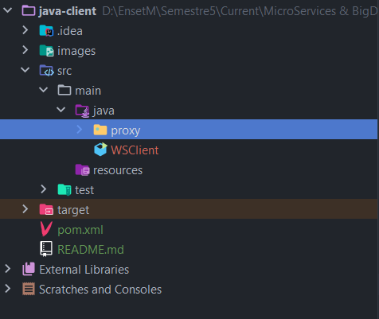
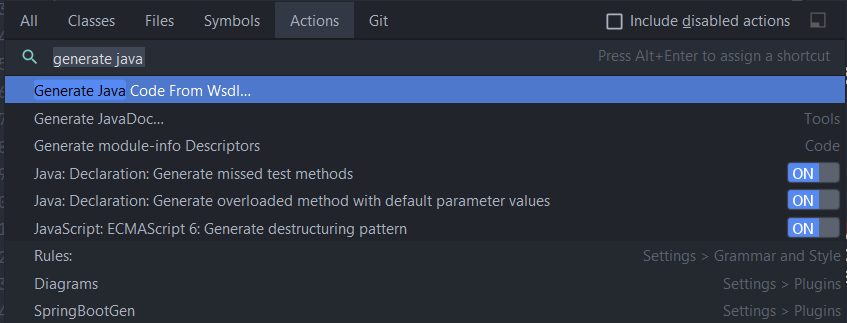
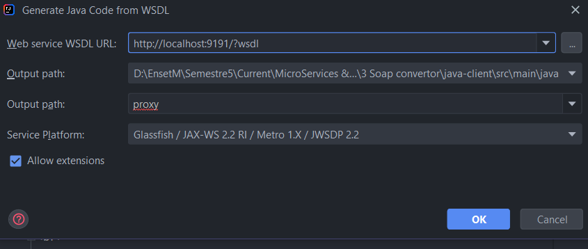
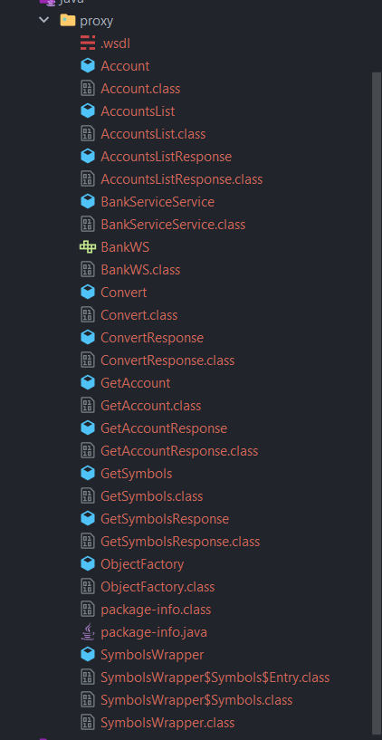
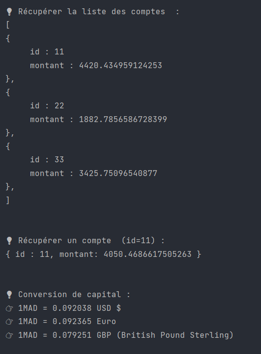

## Créer le client java qui va consommer les méthodes de [soap-ws](../soap-ws)

### Configuration utilisé : 

```
	- projet java meaven
	- java 17
	- packages : 
		- jaxws-ri/com.sun.xml.ws:4.0.0  => implémentation des services web XML de JAKARTA :/
```

👉 Voir le fichier [pom.xml](./pom.xml)

<br>

### Structure de projet :

<p align="center">

</p>

<br>


### Utiliser le fichier [WSDL](../soap-ws-WSDL.xml) pour générer du code et classes nécessaires pour intéragir avec le serveur JaxWS : 

<p align="center">





</p>

<br>


### La classe client : 

* la classe client [WSClient](./src/main/java/WSClient.java) fait appel aux méthodes Soap de serveur et récupère les données: 

```
public class WSClient {

    public static void main(String[] args) {

        BankWS stub = new BankServiceService().getBankWSPort(); // => middleware
        // programmation orientée objet distribuée

        System.out.println("\n\n💡 Récupérer la liste des comptes  : \n[");
        List<Account> list = stub.accountsList();
        list.forEach( account -> {
            System.out.println( "{\n\t id : " + account.getId() );
            System.out.println( "\t montant : " + account.getBalance() );
            System.out.println("},");
        } );
        System.out.println("]");
        
        ...
        
    }
}        
```

<br>

* une partie de l'output : 


<p align="center">

</p>

> end.<