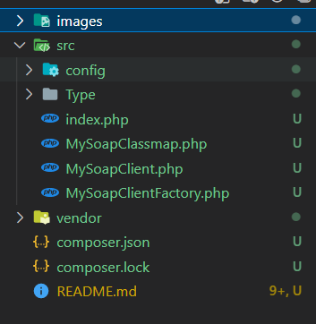
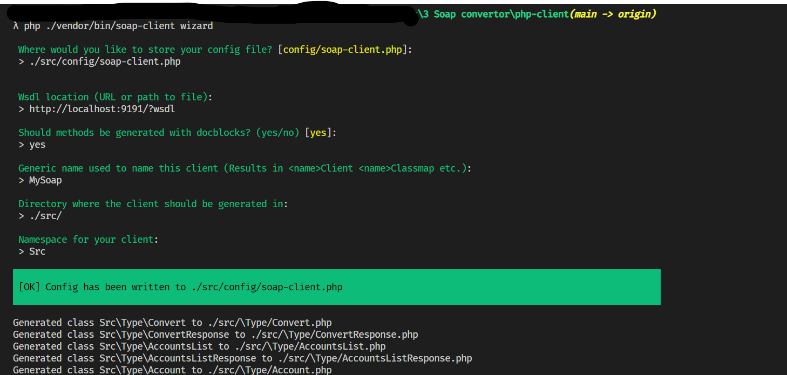
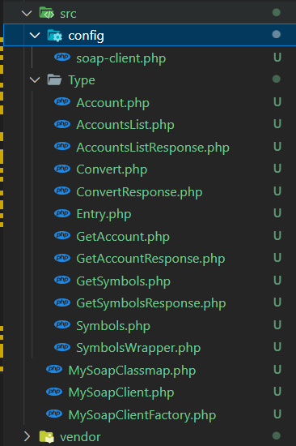
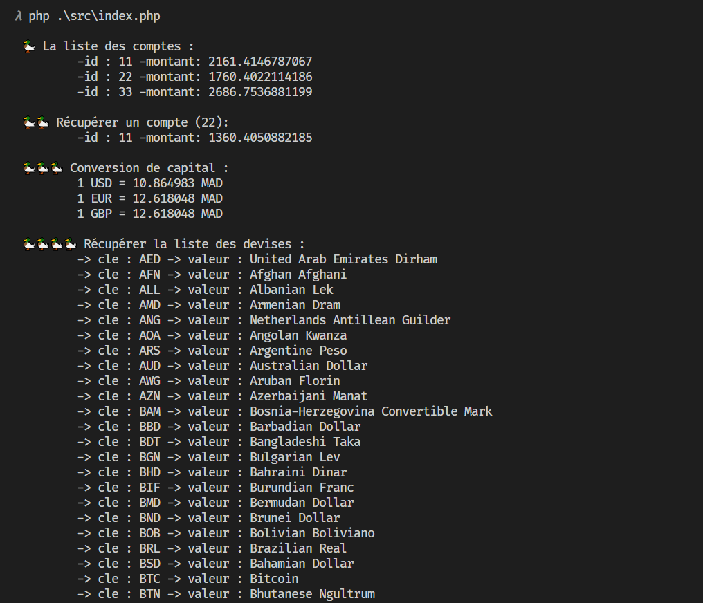

## Créer le client php qui va consommer les méthodes de [soap-ws](../soap-ws)

### Configuration utilisé : 

```
	- projet php (composer)
	- php 8
	- packages : 
		- phpro/soap-client => (il faut d'abord installer : symfony/http-client nyholm/psr7)
    - il faut activer les extentions de php suivantes dans php.ini :
        - intl
        - soap
        - xsl
        - sodium
```

👉 Voir le fichier [composer.json](./composer.json)

<br>

### Structure de projet :

* initialisé un projet composer `composer init` et installé les packages nécessaires : 

<p align="center">

</p>

<br>


### Générer du code et classes nécessaires pour intéragir avec le serveur JaxWS : 

* Le package `phpro/soap-client` qui j'ai utilisé simplifie cette tâche, voir la documentation : https://packagist.org/packages/phpro/soap-client

* après avoir installé les packages, j'ai lancé la commande : `php ./vendor/bin/soap-client wizard`. Cette commande entre dans un mode interactif (interrogeant l'user) pour faire la génération des classes.

<p align="center">

</p>


* les fichiers générés : 

<p align="center">

</p>


<br>


### Le programme client : 

* ensuite j'ai écrit un script/programme qui va utiliser le client SOAP pour communiquer avec le serveur : `~/src/index.php`

[👉 index.php](./src/index.php)

```
<?php
namespace Src;

use Src\Type\AccountsList;
use Src\Type\Convert;

require __DIR__ . '/../vendor/autoload.php';


$soapClient = MySoapClientFactory::factory('http://localhost:9191/?wsdl');


$clientsList = $soapClient->accountsList( new AccountsList() );
echo "\n 🦆 La liste des comptes : ";
$list = $clientsList->getReturn();
foreach( $list as $client ){
    echo "\n\t -id : " . $client->getId() . " -montant: " . $client->getBalance();
}


echo "\n\n 🦆🦆 Récupérer un compte (22): ";
$client = $soapClient->getAccount( new \Src\Type\GetAccount(22) );
$client = $client->getReturn(); 
echo "\n\t -id : " . $client->getId() . " -montant: " . $client->getBalance();


$usd_to_mad = $soapClient->convert(new Convert(1, "USD", "MAD"));
$euro_to_mad = $soapClient->convert(new Convert(1, "EUR", "MAD"));
$euro_to_mad = $soapClient->convert(new Convert(1, "GBP", "MAD"));
echo "\n\n 🦆🦆🦆 Conversion de capital : ";
echo "\n\t 1 USD = " . $usd_to_mad->getReturn() . " MAD";
echo "\n\t 1 EUR = " . $euro_to_mad->getReturn() . " MAD";
echo "\n\t 1 GBP = " . $euro_to_mad->getReturn() . " MAD";

....

```

<br>

* une partie de l'output : 


<p align="center">

</p>

> end.<