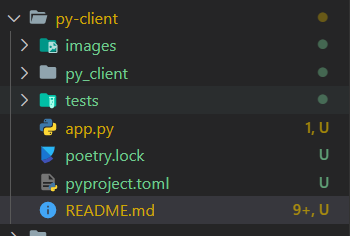
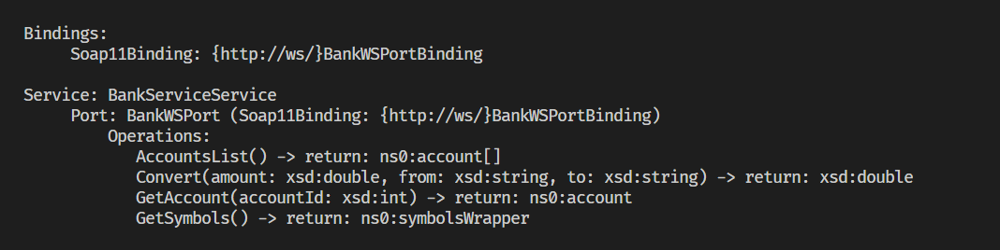
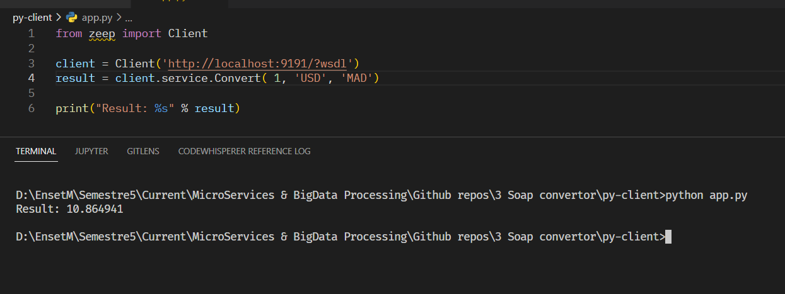
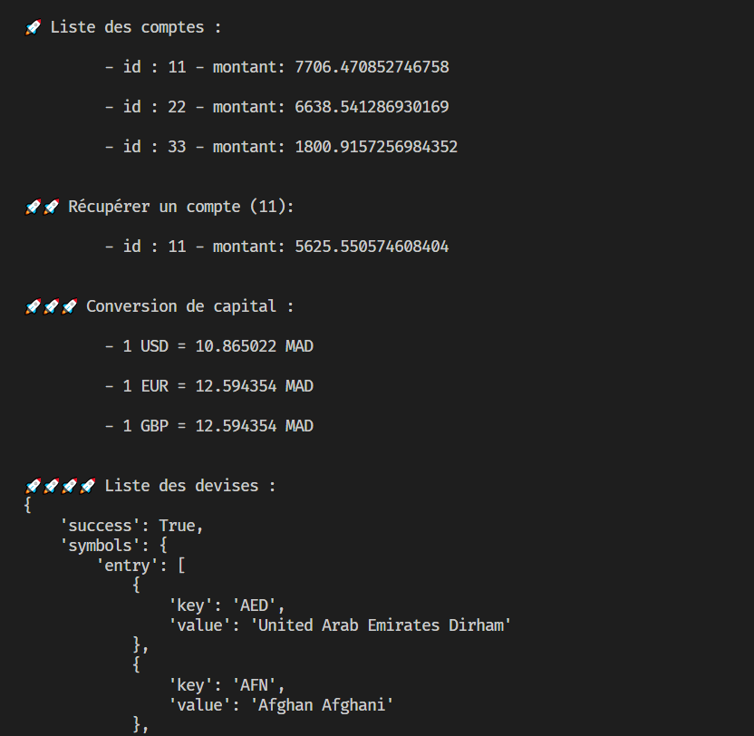

## Créer le client python qui va consommer les méthodes de [soap-ws](../soap-ws)

### Utiliser l'app :

> voir la configuration & lancer le serveur JaxWS

```
$ poetry install 
$ poetry run py app.py

# pour voir les méthodes décrites dans le WSDL lancez :
$ python -mzeep http://localhost:9191/?wsdl
 
```

### Configuration utilisé : 

```
	- projet python
	- python 3.10
	- packages : 
		- zeep (https://docs.python-zeep.org/en/master/)
```

👉 Voir le fichier [pyproject.toml](./pyproject.toml)

<br>

### Structure de projet :

* initialisé un projet poetry `poetry new .` et installé le package zeep : 

<p align="center">

</p>

<br>


### Générer du code et classes nécessaires pour intéragir avec le serveur JaxWS : 

> Pour python et avec ce package que j'utilise, on n'est pas besoin de générer du code, il suffit de voir les méthodes offertes, en exécutant la commande `poetry run python -mzeep http://localhost:9191/?wsdl`, voici l'output : 

<p align="center">

</p>


* rapidement je peux tester ça : 

<p align="center">

</p>

<br>


### Le programme client : 

* ensuite j'ai écrit un script/programme qui va utiliser le client SOAP pour communiquer avec le serveur : `~/app.py`

[👉 app.py](./app.py)

```
from zeep import Client

soapClient = Client('http://localhost:9191/?wsdl')

print("\n🚀 Liste des comptes : ")
accounts = soapClient.service.AccountsList()
for account in accounts:
    print("\n\t - id : "+ str(account.id)+ " - montant: " + str(account.balance))


print("\n\n🚀🚀 Récupérer un compte (11): ")
account = soapClient.service.GetAccount(11)
print("\n\t - id : "+ str(account.id)+ " - montant: " + str(account.balance))

....

```

<br>

* une partie de l'output : 


<p align="center">

</p>


👀

> end.<