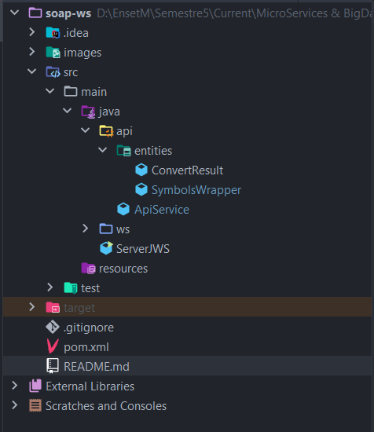
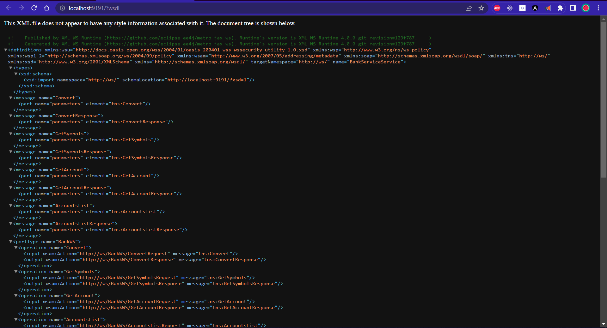
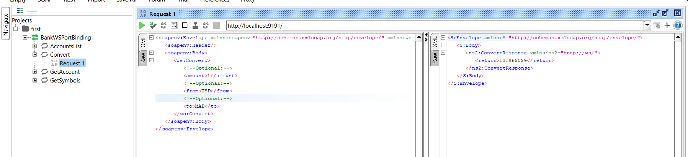
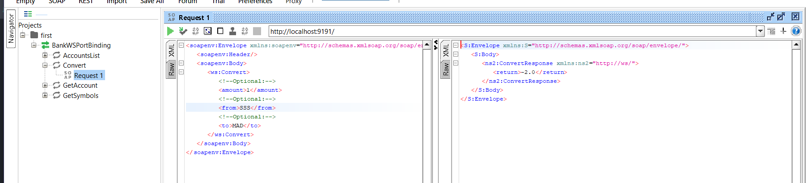
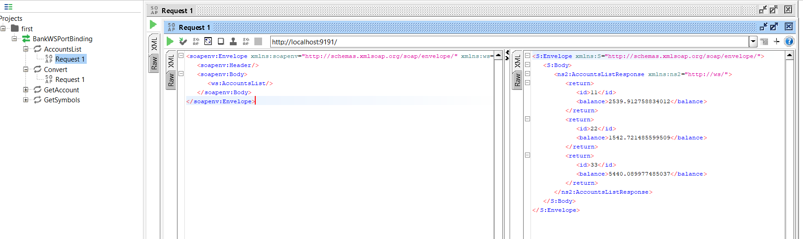
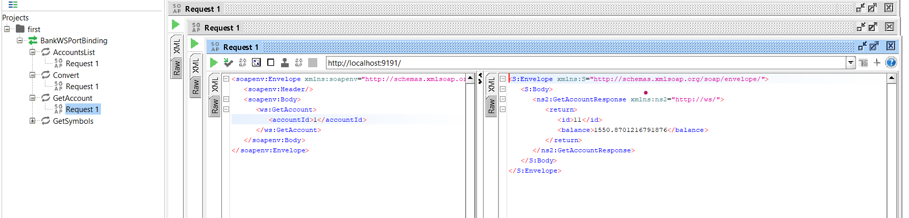
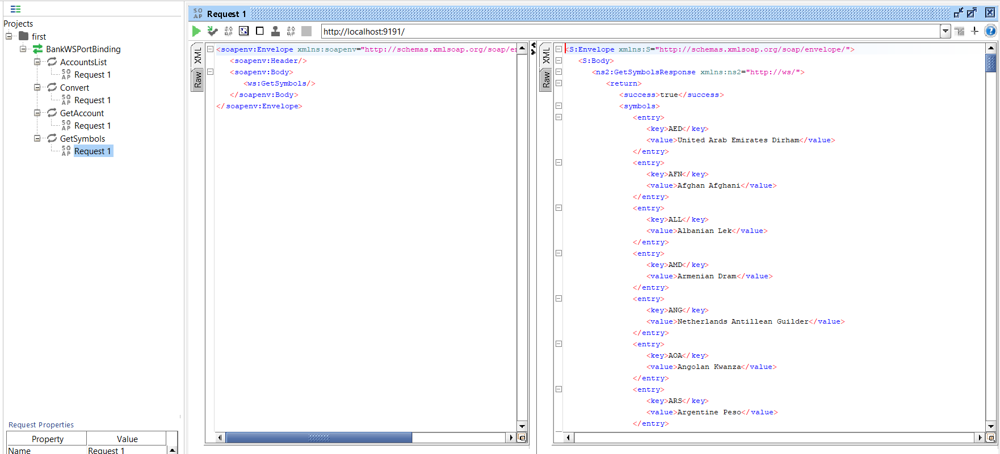

## Création du serveur `JawWS` qui implémente le microservice `BankService`

### Configuration utilisé : 

```
	- projet java meaven
	- java 17
	- packages : 
		- jaxws-ri/com.sun.xml.ws:4.0.0  => implémentation des services web XML de JAKARTA :/
		- okhttp/com.squareup.okhttp3:4.10.0 => client Http pour faciliter de contacter l'api
		- gson/com.google.code.gson:2.10 => faire le mappage de json vers les objets java
```

👉 Voir le fichier [pom.xml](./pom.xml)

<br>

### Structure de projet :

<p align="center">

 
	
</p>

<br>


### La communication avec l'api APILAYER : 

* Pour avoir des conversions exactes, j'ai utilisé l'api de APILAYER, et j'ai regroupé toutes les apis utilisées dans une classe : [~/api/ApiService.java](./api/ApiService.java)
* les apis utilisées : 	
    * `getSymbols()` : récupère les capitaux supportés
    * `convert( String from, String to, String amount)` : fait la conversion
* j'ai utilisé le package `gson` pour faire le mapping Json <-> objet, les classes de ces objets sont définies dans le chemin : [~/api/ApiService/entities/](./api/entities/)
* Exemple

```
public ConvertResult convert( String from, String to, String amount) throws IOException {
        Request request = new Request.Builder()
                .url( apiEndPoint + "convert?to="+to+"&from="+from+"&amount="+amount)
                .addHeader("apikey", apiKey)
                .method("GET", null)
                .build();
        Response response = httpClient.newCall(request).execute();
        String json =  response.body().string();
        ConvertResult result = gson.fromJson(json, ConvertResult.class);
        return result;
}
```

<br>

### Implémenter le webservice `BankService` :

* Ce web service contient les méthodes qui vont être appelées avec SOAP ultiérement, certaines de ces méthodes utilisent les méthodes de la classe `ApiService` ; 

[👉 BankService.java](./src/main/java/ws/BankService.java)
```
@WebService(name = "BankWS")
public class BankService {

    private static SymbolsWrapper symbols;
    private ApiService apiService;

    public BankService(){
        this.apiService = new ApiService();
        this.getSymbols();
    }

    @WebMethod(operationName = "GetSymbols")
    public SymbolsWrapper getSymbols(){
        SymbolsWrapper symbols=null;
        try{
            symbols = this.apiService.getSymbols();
        } catch ( Exception exc ){
            return null;
        }
        BankService.symbols = symbols;
        return symbols;
    }
    
    ...
    
    @WebMethod(operationName = "GetAccount")
    public Account getAccount( @WebParam(name = "accountId") int id){
        return new Account( 11, Math.random()*7733, new Date());
    }
    
    @WebMethod(operationName = "AccountsList")
    public List<Account> accountsList( ){
        return List.of(
                new Account( 11, Math.random()*7733, new Date()),
                new Account( 22, Math.random()*9933, new Date()),
                new Account( 33, Math.random()*5533, new Date())
        );
    }    
}
```

* L'entité `Account` :

[👉 Account.java](./src/main/java/ws/Account.java)

```
@XmlAccessorType(XmlAccessType.FIELD)
@XmlRootElement(name = "Account")
public class Account {

    private int id;
    private double balance;

    @XmlTransient // don't transport this field during serialisation
    private Date created_at;

    public Account() {
    }

    public Account(int id, double balance, Date created_at) {
        this.id = id;
        this.balance = balance;
        this.created_at = created_at;
    }

    public int getId() {
        return id;
    }
    
    ...
    
}
```

 <br>

### Implémenter le webservice avec le serveur JaxWS : 

* lancer le service web sur toutes les interfaces avec l'url `http://0.0.0.0:9191/`
```
public class ServerJWS {
    private static String app_url = "http://0.0.0.0:9191/";
    public static void main(String[] args) {
        Endpoint.publish(app_url, new BankService());
        System.out.println(" 🚀 App launched on : "+app_url);
    }
}
```

 <br>

### Accéder vers le service web avec un navigateur : 

<p align="center">
  
</p>

 <br>

### Tester les endpoints SOAP créées avec SOAPUI :

#### Tester la conversion: 

* Convertir un dollar vers un dirham marocain : 

<p align="center">

</p>

* Si le code du capital n'exist (un problème de validation quelquonque), un code d'erreur est retourné : 

<p align="center">

</p>
 
#### La liste des comptes : 

<p align="center">

</p>

#### Récupérer un compte par id :

<p align="center">

</p>

#### Récupérer la liste des codes des capitaux acceptés :

<p align="center">

</p>

<br>

> end.<